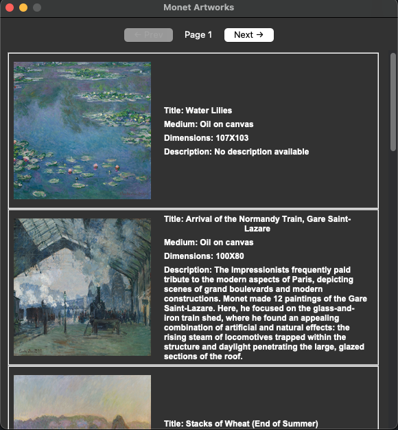

## 🖼️ Monet Art Viewer

A Python GUI application that displays a paginated gallery of Monet artworks from the Art Institute of Chicago's public API. Built with Tkinter, Pillow, and Requests, it offers a scrollable view of artwork cards, each showing image, title, medium, dimensions, and description.

---

## Features

-   Fetches real-time Monet artwork data from the Art Institute API
-   Displays artwork in a scrollable, card-based layout
-   Caches and loads images from URLs
-   Includes pagination with "Previous" and "Next" buttons

---

## How It Works

-   Calls the Art Institute's API and parses JSON responses
-   Constructs IIIF image URLs to load artwork thumbnails
-   Uses a custom `CharacterConstructor` class to organize artwork data
-   Renders GUI using Tkinter with a ScrollableFrame
-   Clears and repopulates cards on each page navigation load

---

## App Preview



---

## Requirements

-   Python 3.7+
-   pip modules:
    -   requests
    -   pillow

Install them with:

```bash
pip install -r requirements.txt
```

---

## Run the App

```bash
python main.py
```

---

## API Reference

Powered by the [Art Institute of Chicago API](https://api.artic.edu/docs/)

---

## Ideas for Future Improvements

-   Local image caching
-   Offline viewing mode
-   Search/filter by medium or keyword
-   Dark mode UI toggle
-   Save favorites/bookmarks
-   Unit tests for data parsing and rendering

---

## Author

Built by Alvaro O.
